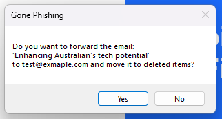
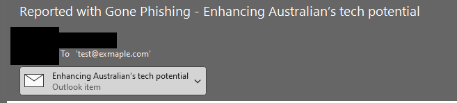

# Gone Phishing

-------------------

This add-in for Outlook will add a new button to the main ribbon, and should be used as a simple solution for reporting SPAM and Phishing emails to an assigned address:<br>


When clicked, it will ask if you want to forward the selected email, and move the item to junk:<br>
<br>
Hitting 'No' will stop all functions, hitting yes will make it happen.

If you try and forward multiple emails by selecting more then one, it'll throw an error:<br>


After selecting 'Yes', the add-in will add a prefix to the email, and send it to the address. In sent items it will look like:<br>


Both the address and prefix are saved as strings in the registry, so can be editing down the track with Group Policy as needed:<br>
<br>
The path used will depend on the architecture of the installer.
```
HKLM:\Software\Microsoft\Office\Outlook\Addins\GonePhishing
```
for 64-bit Office installs, and<br>
```
HKLM:\Software\WOW6432Node\Microsoft\Office\Outlook\Addins\GonePhishing
```
for 32-bit.

## Caveats
The only caveats is that the email will send from the primary one set in Outlook. So if you had additional mailboxes added (like a delegate or group mailbox), and you reports a suspsicous email, it will appear in __your__ sent items, not the mailbox it may have come into


Like anything, make sure you test properly before doing a larger rollout.